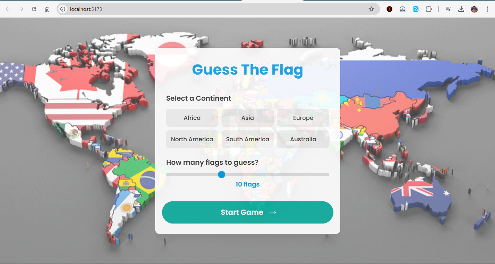
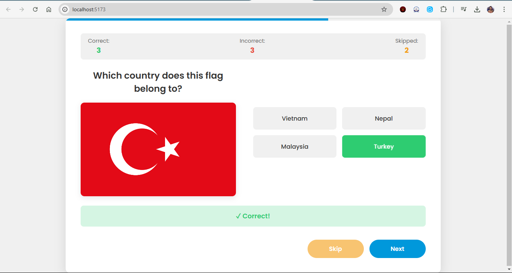
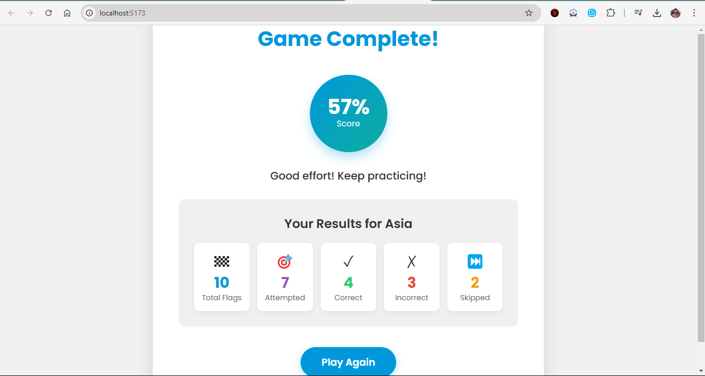

# 🌎 Guess The Flag Game



A fun and interactive flag guessing game built with React that tests your knowledge of world flags. Challenge yourself to identify flags from different continents and track your progress!

## 📋 Features

- **Continental Selection**: Choose flags from Africa, Asia, Europe, North America, South America, or Australia/Oceania
- **Customizable Experience**: Select how many flags you want to guess (5-20)
- **Interactive UI**: Smooth animations and transitions using Framer Motion
- **Responsive Design**: Play on any device - desktop, tablet, or mobile
- **Score Tracking**: Keep track of correct, incorrect, and skipped answers
- **Performance Feedback**: Get a detailed breakdown of your performance at the end
- **Skip Option**: Skip difficult flags and move on to the next one
- **Dynamic Loading**: Optimized image loading for better performance

## 🖼️ Screenshots

### Start Screen


### Gameplay


### Results Screen


## 🛠️ Technologies Used

- **React**: Frontend library for building the user interface
- **Framer Motion**: Animation library for smooth transitions and effects
- **CSS3**: Styling with modern CSS features
- **Vite**: Fast build tool and development server
- **JavaScript ES6+**: Modern JavaScript features
- **Responsive Design**: Flexbox and CSS Grid for layout

## 🚀 Installation and Setup

1. Clone the repository:
   ```bash
   git clone https://github.com/umair763/Guess-The-Flag-Game.git
   cd guess-the-flag
   ```

2. Install dependencies:
   ```bash
   npm install
   ```

3. Start the development server:
   ```bash
   npm run dev
   ```

4. Build for production:
   ```bash
   npm run build
   ```

## 🎮 How to Play

1. **Start Screen**: Select a continent and choose how many flags you want to guess
2. **Gameplay**: Look at the displayed flag and select the correct country from the four options
3. **Navigation**: Use the "Skip" button to skip difficult flags or "Next" to proceed after answering
4. **Results**: After answering all questions, view your performance statistics and score

## 📁 Project Structure

   ```bash
guess-the-flag/
├── public/
│   └── ...
├── src/
│   ├── assets/
│   │   └── flags/
│   │       └── [country-code].png
│   ├── components/
│   │   ├── FinishCard.jsx
│   │   ├── FinishCard.css
│   │   ├── GuessCard.jsx
│   │   ├── GuessCard.css
│   │   ├── InitialFlagContainer.jsx
│   │   ├── InitialFlagContainer.css
│   │   ├── LoadingScreen.jsx
│   │   └── LoadingScreen.css
│   ├── utils/
│   │   └── flagUtils.js
│   ├── App.jsx
│   ├── App.css
│   ├── main.jsx
│   └── index.css
├── package.json
└── vite.config.js
   ```

## 🧠 Game Logic

- The game randomly selects flags from the chosen continent
- For each flag, it presents four country options (one correct, three incorrect)
- The player selects an answer, and immediate feedback is provided
- Score is calculated based on correct answers vs. total attempted questions
- Performance statistics track correct, incorrect, and skipped answers

## 🌟 Key Features Explained

### Dynamic Flag Loading

The game uses a static import map to efficiently load flag images:

```javascript
// Create a map of country names to flag images
const flagImageMap = {
  "United States": usImage,
  "United Kingdom": gbImage,
  // ... more countries
}
```

### Responsive Design

The game adapts to different screen sizes with responsive CSS:

```css
@media (max-width: 768px) {
  .guess-card-container {
    padding: 20px;
  }
  
  .options-container {
    grid-template-columns: 1fr;
  }
}
```

### Animations with Framer Motion

Smooth animations enhance the user experience:

```jsx
<motion.div
  className="flag-container"
  initial={{ opacity: 0, y: 20 }}
  animate={{ opacity: 1, y: 0 }}
  key={currentFlagIndex}
  transition={{ duration: 0.3 }}
>
  {/* Content */}
</motion.div>
```

### Score Calculation

The game tracks various statistics:

```javascript
setGameStats((prev) => ({
  ...prev,
  attemptedScore: prev.attemptedScore + 1,
  correctGuesses: correct ? prev.correctGuesses + 1 : prev.correctGuesses,
  incorrectGuesses: !correct ? prev.incorrectGuesses + 1 : prev.incorrectGuesses,
}))
```

## 🔮 Future Improvements

- Add a timed mode with countdown timer
- Implement difficulty levels (easy, medium, hard)
- Add a leaderboard with local storage
- Include more detailed information about each country after answering
- Add sound effects and background music
- Implement a hint system


## Project Links

You can access the deployed web application here: [Web App Link]([https://your-web-app-link.com](https://guess-the-flag-game-one.vercel.app/))
